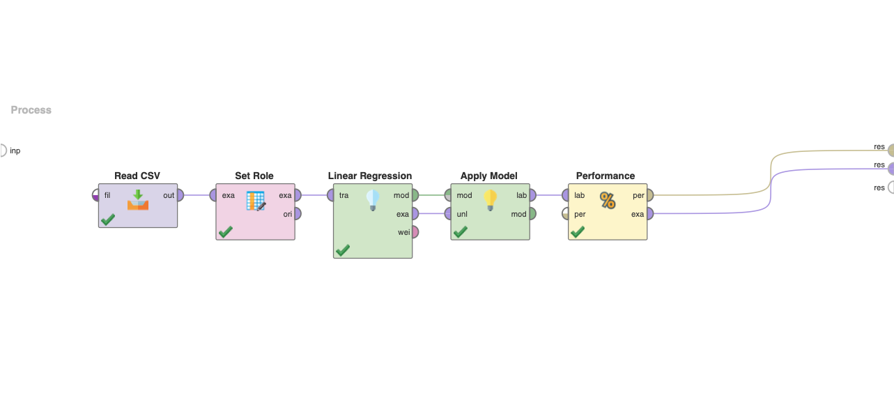

# Linear Regression

Linear regression is a statistical method that models the linear relationship between a dependent variable and one or more independent variables. It is a commonly used technique in data analysis and predictive modeling.

> Example data can be found in the [`data`](./data/) directory

## Project Preview

## Regression (Regression Berechnung)

A regression project file that contains a set of data processing and modeling operations designed to create a regression model based on input data. It involves importing data, preprocessing, selecting relevant features, creating the regression model, and evaluating its performance using metrics such as MSE and RMSE.

## Bodyfat Calculation

### MSE & RMSE (4e)

This section creates a process to predict body fat percentage using a single attribute with good correlation. The process involves importing data, selecting a suitable attribute, creating a linear regression model using the Linear Regression operator, and evaluating its performance using metrics such as MSE and RMSE.

### Regression Visualization (4f)

In this section, a process is created to predict body fat percentage using two attributes. The process involves importing data, selecting two suitable attributes, creating a linear regression model using the Linear Regression operator, and visualizing the model using the Scatter 3D graph. The perspective of the graph is rotated to gain insight into the relationship between the attributes and the target variable.

## Automated Attribute Selection

### Forward Selection (5a)

This section optimizes the model by automatically selecting the best attributes using the Forward Selection operator. The process involves trying out all possible attribute combinations and selecting the best performance. The resulting model is evaluated based on its number of attributes and dimensions.

### Attribute Weighting (5b)

In this section, the Log operator creates a table of attribute weights based on individual RMSEs. The operator Log to Data is then used to visualize the results. The process helps understand unique attributes' impact on the overall model performance.

### Model Creation (5d)

This section creates a new RapidMiner process based on the automatically selected attributes. The process involves importing data, choosing the best attributes, creating a linear regression model using the Linear Regression operator, and evaluating its performance using metrics such as MSE and RMSE.
