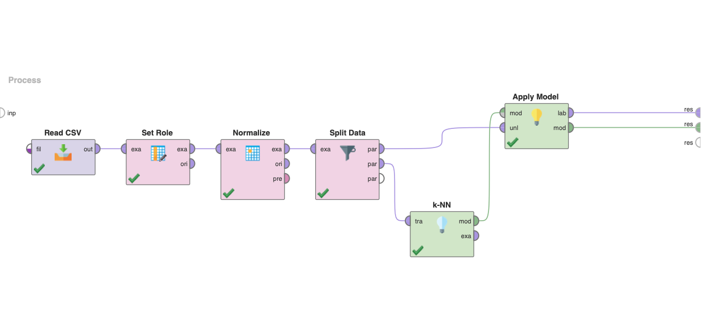
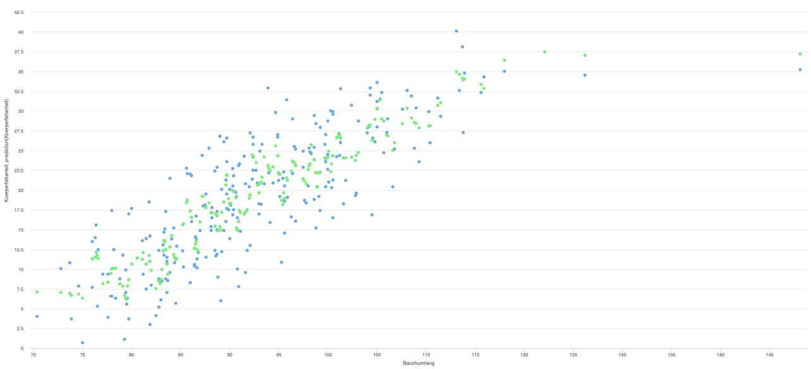

# K-Nearest Neighbor

K-nearest neighbor (KNN) is a non-parametric algorithm for classification and regression tasks. It works by finding the k-nearest neighbors of a data point based on a distance metric and predicting the class or value based on the majority vote or average of the neighbors. It is a simple and effective algorithm that requires minimal training but can be computationally expensive for large datasets.

> Example data can be found in the [`data`](./data/) directory

## Project Preview

## KNN

> File: `Einkommen_Berechnung.rmp`

A project file that contains a set of data processing and modeling operations designed to create a KNN model based on income data. It involves importing data, preprocessing, normalizing, creating the KNN model, and evaluating its performance using metrics such as RMSE.

## Bodyfat Calculation

### KNN Model (5a)

This section uses a RapidMiner process to predict body fat percentage using a single attribute with KNN. The process involves importing data, selecting a suitable attribute, normalizing it, creating a KNN model using the KNN operator, and evaluating its performance using RMSE. The resulting model is compared with the linear regression model.

### Automated Attribute Selection (5b)

This section optimizes the model by automatically selecting the best attributes using an attribute selection operator. The individual RMSE values and the selected attribute names are logged using the Log operator. The resulting model is then applied to the data.

### K Value Optimization (5c)

The model is further optimized in this section by automatically selecting the best k value using the Optimize Parameters (Grid) operator. The results are evaluated, and any unusual RMSE matters are investigated.

### Data Splitting (5e)

This section separates the test data from the training data using the Split Data operator. The process ensures that the model is tested on data it has not been trained on, avoiding overfitting.
