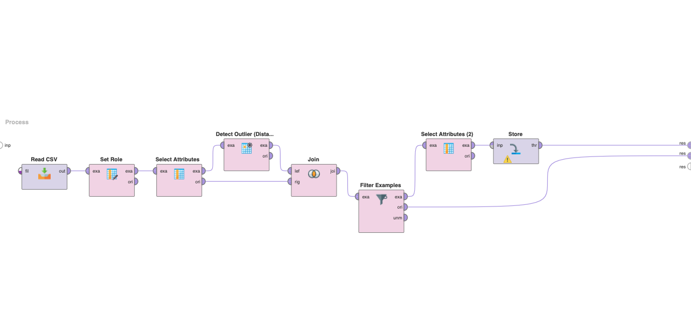
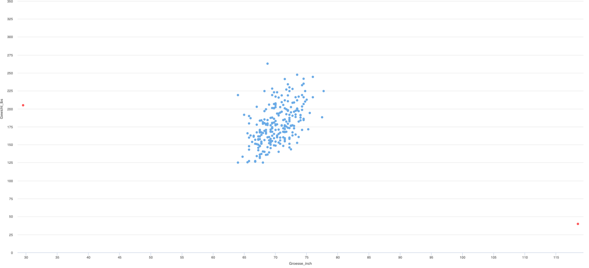
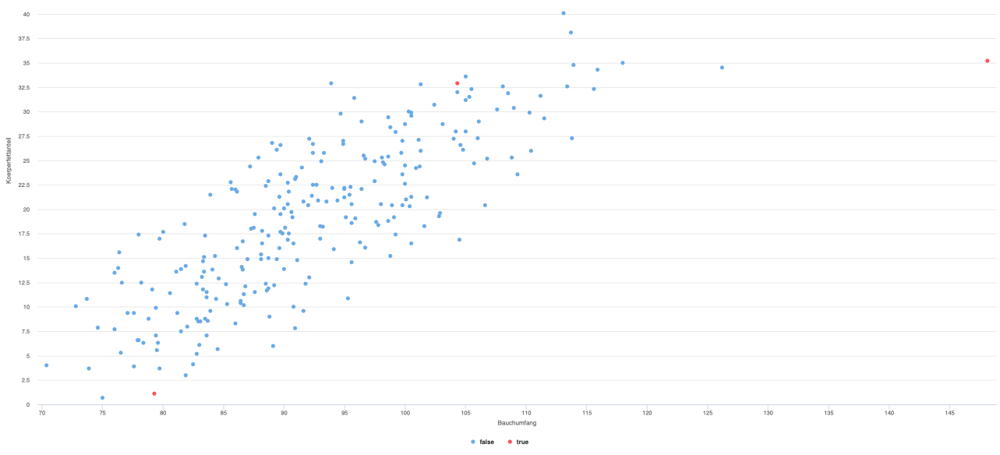

# Data Preprocessing

Data preprocessing is an essential step in data analysis and machine learning. It involves transforming raw data into a format suitable for analysis, identifying and correcting errors, handling missing or invalid values, and removing outliers. The goal is to ensure the data is accurate, complete, and relevant for the analysis.

> Example data can be found in the [`data`](./data/) directory

## Project Preview

## Bodyfat Calculation (Bodyfat Berechnung)

### Distance-based Exploratory Analysis (2b)

This section creates a process to import the bodyfat data and perform exploratory data analysis using the Detect Outlier (Distances) operator. The operator identifies outliers and marks them with a different color in the scatter plots. The number of outliers and the value of k are adjusted to obtain a good result.

### Outlier Removal (2d)

This section removes the outliers and the density attribute from the data. Removing the outliers helps reduce the impact of extreme values on the analysis. Removing the density attribute may improve the model's performance since it is highly correlated with other attributes.

### Linear Regression with Optimized Selection (2e)

This section creates a new linear regression model with optimized attribute selection using the processed bodyfat data. The resulting model is compared with the one obtained from the unadjusted data.

## Deathrate Calculation (Deathrate Berechnung)

### RE-based Exploratory Analysis (3b)

In this section, the death rate data is read, and exploratory data analysis is performed to identify outliers and missing values using regular expressions.

### Outlier Removal (3c)

In this section, the outliers are identified and removed from the data, and the outlier attribute is removed. Removing the outliers and the outlier attribute helps improve the analysis's accuracy and the model's quality.

### Regression Analysis on Processed Data (3d)

This section performs an improved regression analysis on the processed data obtained from the outlier removal before. The regression analysis helps to investigate the relationship between the death rate and the independent variables. The regression model can be used to predict the death rate based on the values of the independent variables.
