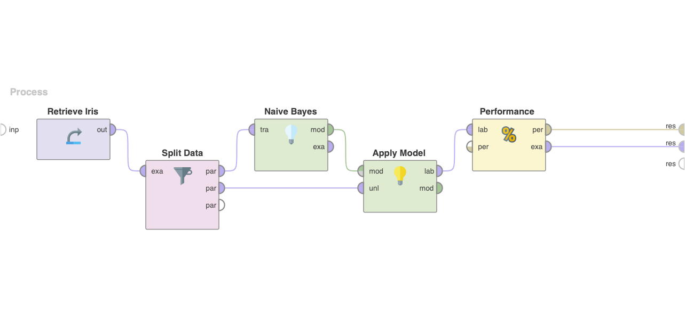

# Naive Bayes

Naive Bayes is a simple yet effective classification algorithm widely used in extensive data analysis. It is based on Bayes' theorem, which uses conditional probabilities to calculate the likelihood of a particular class given a set of input variables. The Naive Bayes algorithm assumes that all input variables are independent of each other, simplifying the probability calculation. Naive Bayes is instrumental in cases where the number of input variables is large and the dataset is imbalanced.

> Example data can be found in the [`data`](./data/) directory

## Project Preview

## Naive Bayes (2)

In this example, a dataset of flower petal measurements is created to demonstrate the use of Naive Bayes classification.

### Probability Calculation & Classification (2a)

In this section, the probabilities for each class are calculated for the last three test sets, and the class membership is determined using the Naive Bayes algorithm. The results are compared with the class-default from the test set to evaluate the accuracy of the classification.

### Numeric Attribute Handling (2b)

This section discusses the handling of numeric attributes in Naive Bayes. Numeric attributes can be handled in different ways, such as discretization, normalization, or using Gaussian distribution assumptions. In RapidMiner, the Discretize operator can be used to convert numeric attributes into discrete values, improving the classification's accuracy.
