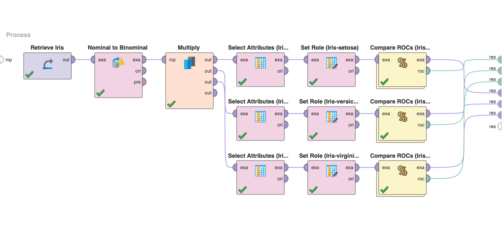

# Quality Measures and Error Costs

Quality measures and error costs are essential considerations in big data analysis. These measures provide a way to evaluate the accuracy and reliability of predictions made by machine learning algorithms. Standard quality measures include mean squared error (MSE), root mean squared error (RMSE), and accuracy rate. A confusion matrix is used to evaluate the performance of binary classifiers, and error costs are assigned to different types of errors to reflect their relative importance. The receiver operating characteristic (ROC) curve and precision-recall (PR) diagram are widely used methods for evaluating the performance of classifiers. They help to compare different classifiers and determine optimal parameter values.

> Example data can be found in the [`data`](./data/) directory

## Project Preview

## Comparing Classifier Performance with ROC

This project section creates a new RapidMiner process to load the Iris data from the sample data in the local repository. The ROC curves for the Naive Bayes and k-NN procedures are then compared to evaluate the performance of these classifiers on the Iris data.

### Process Setup and Data Loading (2)

To compare the performance of Naive Bayes and k-NN classifiers, a process is created and the Iris dataset loaded into the process. Naive Bayes and k-NN classifiers are used to predict the class labels for the Iris dataset.

### Classifier Comparison and Evaluation (3)

The ROC curves are generated for both classifiers: Naive Bayes and k-NN, to evaluate their performance. The ROC curves are then compared to determine which classifier performs better on the Iris dataset.
